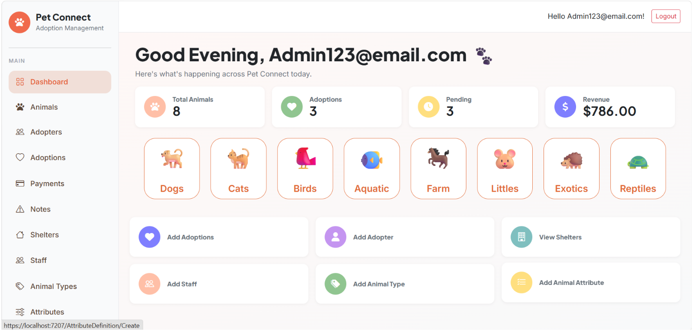
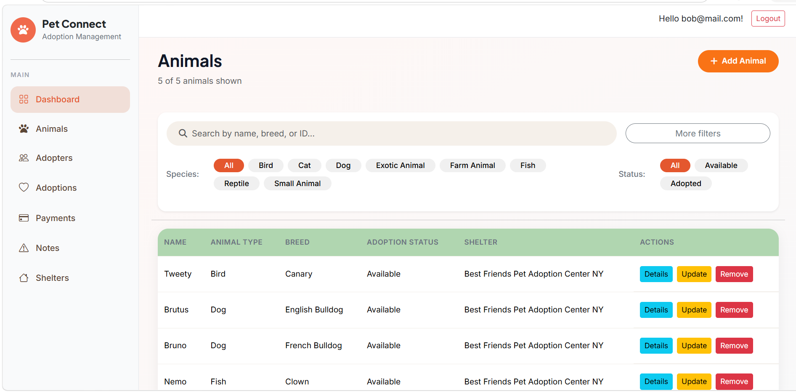
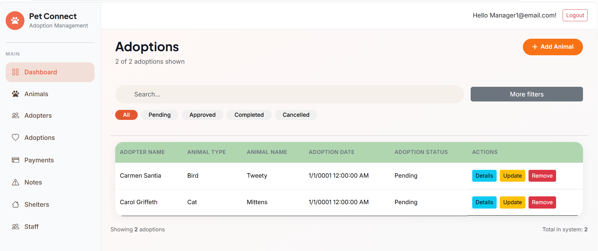
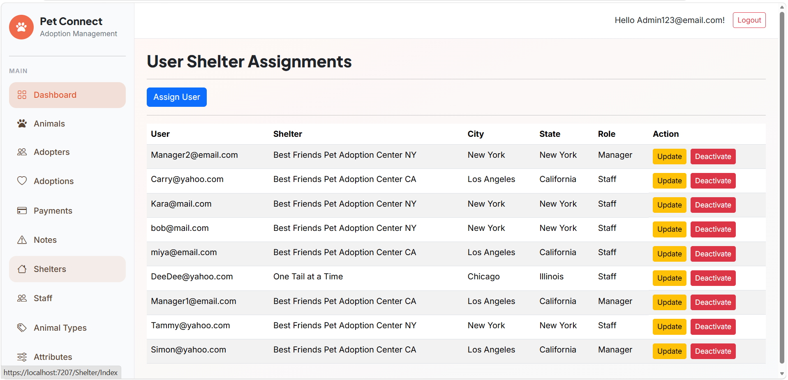
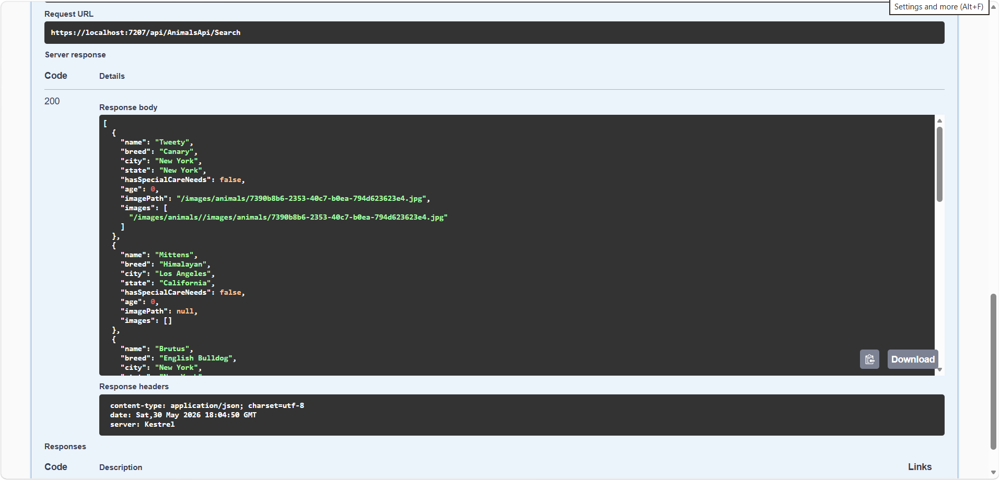

# PetConnect  

PetConnect is a multi-location animal shelter management application built with ASP.NET Core MVC using a layered, service-based architecture inspired by Clean Architecture principles.

The application manages shelters, animals, adopters, adoptions, payments, staff, and administrative workflows while enforcing role-based access control across multiple shelter locations.

---

## Project Overview

PetConnect was designed to simulate real-world shelter operations through a structured web application that emphasizes:

- Separation of concerns
- Maintainable backend architecture
- Role-based authorization
- Multi-location data management
- Scalable CRUD operations
- Dashboard reporting and analytics

The system supports multiple shelters across different locations, each with its own staff, managers, animals, adopters, payments, and adoption records.

---

## Screenshots

### Dashboard

### Animal Management

### Adoption Workflow

### Admin Management

### Swagger 

---

## Features

### Authentication & Authorization

- ASP.NET Core Identity authentication
- Role-based access control (RBAC)
- Protected routes and restricted operations
- Shelter-scoped data access

### Role Permissions

#### Staff
- Manage animals
- Manage adopters
- Manage adoptions
- Manage payments
- Create and view notes
- View shelters assigned to their location

#### Manager
Includes all Staff permissions plus:
- Create staff accounts
- Update staff information
- Deactivate staff accounts

#### Admin
Full system access including:
- Manage all shelters
- Manage all users and staff
- Manage animal types and attributes
- Global reporting and dashboard access
- Access to all shelter data

---

## Permission Overview

| Feature | Staff | Manager | Admin |
|---|---|---|---|
| Manage Animals | Yes | Yes | Yes |
| Manage Adopters | Yes | Yes | Yes |
| Manage Payments | Yes | Yes | Yes |
| Manage Staff | No | Yes | Yes |
| Manage Shelters | No | No | Yes |
| Manage Animal Types | No | No | Yes |

---

## Core Functionality

### Animal Management
- Create, update, and deactivate animals
- Track adoption status
- Assign animal types and attributes
- Store shelter-specific records
- Upload and manage profile and gallery images per animal
- Set a primary profile image 

### Adoption Workflow
- Manage adoption lifecycle
- Link adopters to animals
- Track adoption status and shelter-related payments
- Maintain operational notes attached to records

### Shelter Management
- Multi-location shelter support
- Shelter-specific data isolation
- Staff assignment by shelter

### Payment Tracking
- Track adoption-related payments
- Support shelter-scoped payment visibility
- Separate donation records from shelter operational payments

### Notes System

Users can create and manage notes attached to operational records including:

- Animals
- Adopters
- Adoptions
- Payments

This allows shelter staff to maintain contextual records and workflow-related updates tied to specific entities.

### Dashboard & Reporting
Role-specific dashboards displaying:
- Animal totals
- Adoption statistics
- Pending adoptions
- Revenue tracking
- Animal trend charts
- Animal type distribution charts

### Search & Filtering
Search and filtering functionality implemented for:
- Animals
- Adopters
- Adoptions

---

## Architecture

The application follows a layered architecture inspired by Clean Architecture concepts.

### Project Structure

#### Presentation Layer
- ASP.NET Core MVC Controllers
- Razor Views
- ViewModels

#### Application Layer
- Query services (read operations)
- Command services (write operations)
- Business logic

#### Domain Layer
- Core entities
- Interfaces and contracts

#### Infrastructure Layer
- Entity Framework Core
- SQL Server persistence
- Data access implementation

---

## Technology Stack

- ASP.NET Core MVC
- C#
- Entity Framework Core
- SQL Server
- ASP.NET Core Web API (Animal Listing API)
- ASP.NET Core Identity 
- LINQ
- Bootstrap 5
- Razor Views
- Swagger (OpenAPI)

---

## Testing

Manual QA testing was performed for:

- Authentication workflows
- Authorization and protected routes
- CRUD operations
- Validation handling
- Edge cases
- Role permissions

See `TESTING.md` for detailed test cases and known issues.

---

## Known Limitations

Current known issues and planned improvements:

- Pagination not yet implemented for API or UI
- Limited automated testing coverage
- Image storage currently file-based (not cloud hosted yet)
- Dynamic attribute filtering not yet exposed in API

---

## Deployment

Deployment (Planned Improvements)

- Planned cloud deployment using AWS 
- Future migration of image storage to Amazon S3 for scalable media handling
- Potential use of AWS RDS for managed SQL Server hosting

---

## Learning Goals Demonstrated

This project demonstrates practical experience with:

- ASP.NET Core MVC development
- ASP.NET Core Web API design
- Entity Framework Core
- DTO-based API architecture
- Authentication & authorization
- Role-based access control
- Service-layer architecture
- Clean separation of concerns
- Relational database design
- REST API development with Swagger
- Dashboard and reporting systems
- Manual QA testing practices
- File upload and media management systems

---

## About

Developed by Tanya Thomas as a portfolio project focused on backend architecture, scalable application structure, and real-world workflow management using ASP.NET Core technologies.

